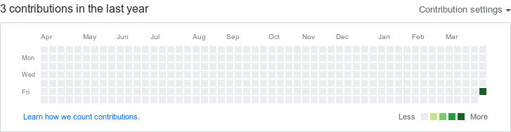

# all-green
A tool made to make your contribution calendar go all green (for fun)

## Description

I  declare that this tool is made entirely for fun and learning some shell. Inappropriate use of this is not to be considered creater's fault.

This tool converts your GitHub contribution calendar to all green. Isn't it amazing ;)

If you are here just for testing purpose, Kindly do it in another GitHub account (probably some secret one) or you can delete that repo later.

## PROOF

This is how profile looked **before**.

This is how it looked **after**.

## RUN

### create a new repo in your GitHub profile.

clone that repo.

Download or clone this repo and copy `main.sh` file into your newly created repo.

run main.sh file as sudo

`sudo bash main.sh`

Enter starting date.

Enter end date.

finally `PUSH` your repo to see the magic.

`git push -u origin master`

## Contributors

* Shailesh Kumar Sahu - [shellkore](https://github.com/shellkore)
* Pranav Bhaskar - [Pranav-Bhaskar](https://github.com/Pranav-Bhaskar)

> Only for entertainment and educational purpose

